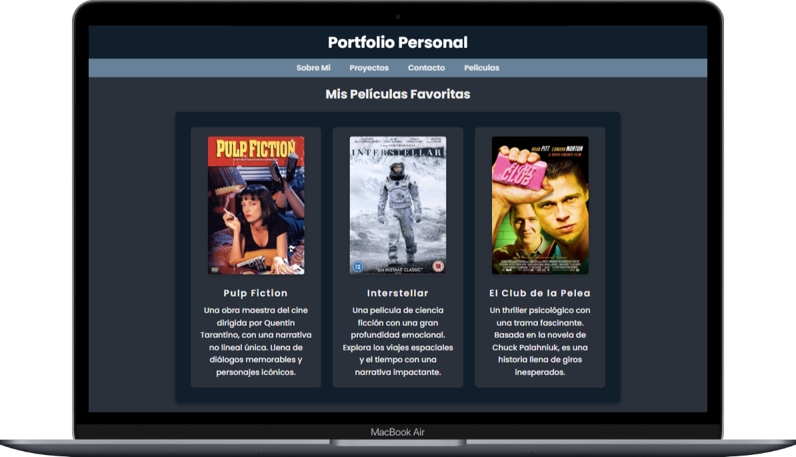
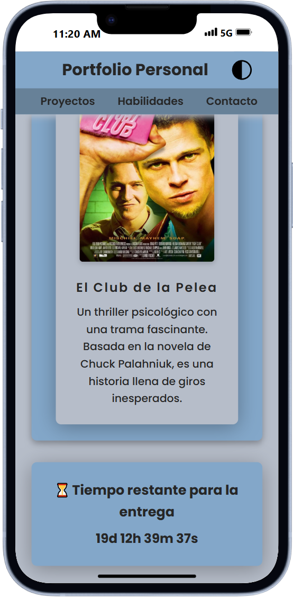
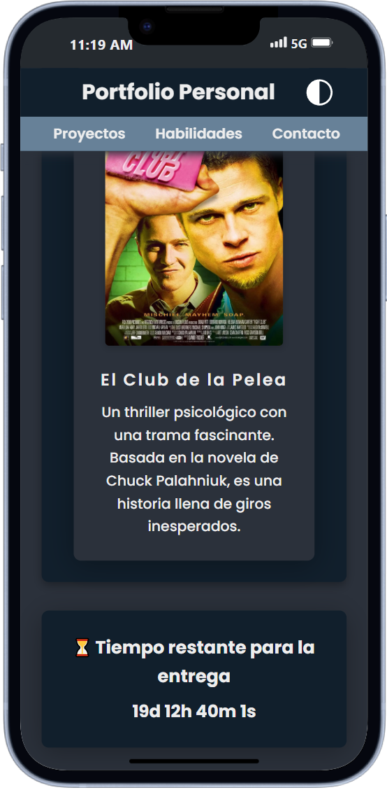

# ✨ Portfolio Personal – Práctica Formativa Obligatoria 2

¡Bienvenido a mi portfolio! 🎨

Este proyecto fue desarrollado como parte de una práctica formativa, y tiene como objetivo mostrar un poco de mí, mis gustos, habilidades y proyectos personales.  
En esta segunda parte se han agregado mejoras, funcionalidad y optimizaciones de código que se detallan a continuación.

---

## 🧩 Secciones del Sitio

1. 👤 **Sobre mí** – Presentación personal y un poco de quién soy.
2. 🎬 **Películas favoritas** – Algunas de las pelis que más me gustan.
3. 📬 **Contacto** – Para que puedas comunicarte conmigo fácilmente.
4. 💻 **Proyectos** – Muestras de trabajos y creaciones personales.
5. 🧠 **Habilidades** – Tecnologías que manejo y las que quiero seguir aprendiendo.

---

## 🧠 Funcionalidades con JavaScript

### 1. Validaciones del formulario de contacto

Realicé una una validación personalizada al momento de enviar el formulario.  
Se verifica que **todos los campos estén completos**, y se validan específicamente el formato del **correo electrónico** y el **teléfono** con expresiones regulares.  
Esto permite una retroalimentación inmediata al usuario y mejora la experiencia de uso.

Elegí esta validación manual para tener **mayor control del flujo** y poder combinarla con los mensajes emergentes personalizados.

---

### 2. Implementación del cambio de tema de forma global

Utilicé un botón que alterna la clase en el `<body>` (`dark-theme`) para cambiar el esquema de colores del sitio de forma global.  
En caso de no estar presente la clase cae al fallback que es el tema claro.
Ademas al presionar el botón que cambia el tema activa una clase `active` que provoca una **animación CSS temporal**.

Me pareció una forma **sencilla y efectiva** de manejar ambos temas.

---

### 3. Pop-up informativos generados dinámicamente según el estado del formulario

Desarrollé una función `showPopup()` que muestra un mensaje personalizado en pantalla acompañado de un ícono representativo según el tipo de mensaje: éxito, error, advertencia o información.  
El pop-up se muestra durante 2 segundos y se oculta automáticamente.

Permite una retroalimentación visual rápida sin redireccionamientos ni alertas nativas molestas. Es una solución más simple y elegante que abrir un modal en pantalla completa.

---

### 4. Renderizado dinámico de peliculas

Implementé el renderizado dinámico de una lista de películas en lugar de escribir manualmente cada elemento en el HTML. Se usa un array de objetos que contiene los datos de cada película (título, imagen, descripción, enlace). Con un bucle voy creando e insertando los elementos dinamicamente. Elegí esta solución para practicar la manipulación del DOM y trabajar con estructuras dinámicas.

---

### 5. Temporizador de entrega del trabajo práctico

Se incorporó un temporizador con cuenta regresiva hacia la fecha límite de entrega (5 de mayo de 2025).  
El contador se muestra centrado al final de la página, actualizándose cada segundo y mostrando días, horas, minutos y segundos restantes.

Se uso asistencia por chat para realizar los calculos entre fechas para no usar librerias de terceros.

---

## 🛠️ Mejoras o Cambios en el Diseño y Código

### 1. Rediseño del menú de navegación

Se adaptó el menú para ser **responsive**, con desplazamiento horizontal en pantallas pequeñas. Lo vi en una web y me gusto. En lugar del típico menu hamburguesa.

### 2. Reestructuración del CSS

Los estilos fueron organizados por secciones y se corrigieron duplicaciones. Se agregó media queries donde se necesitaba usando la forma profesional, anidado en el selector que lo requeria para mayor legibilidad.

### 3. Enlaces reales y botones interactivos

Se agregaron enlaces funcionales en las secciones de proyectos, habilidades y películas.

### 4. Efectos visuales en elementos interactivos

Se aplicaron transiciones y animaciones a los botones y enlaces.

### 5. Nueva paleta de colores

Se incorporó una paleta nueva para el modo claro, mejorando la estética general.
Por último se usaron variables globales para manejar los temas de forma más clara.

---

## 🖼️ Comparación Visual entre Versiones

### 🔹 Versión 1 – Entrega inicial con solo modo oscuro sin js

  

---

### 🔹 Versión 2 – Versión actual con mejoras y ambos temas

  
  

---

🔗 **URL del sitio :** [👉 Ver mi Portfolio](https://mgalim.github.io/front-PFO2/)

## 🙌 ¡Gracias por visitar mi portfolio!
